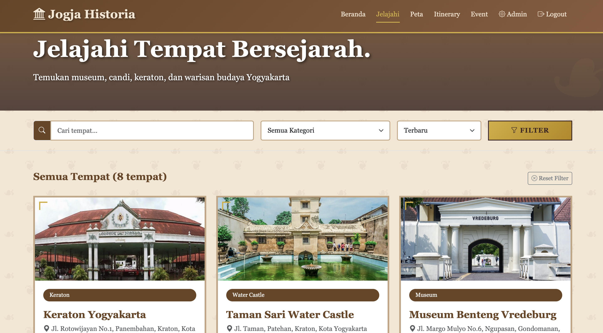
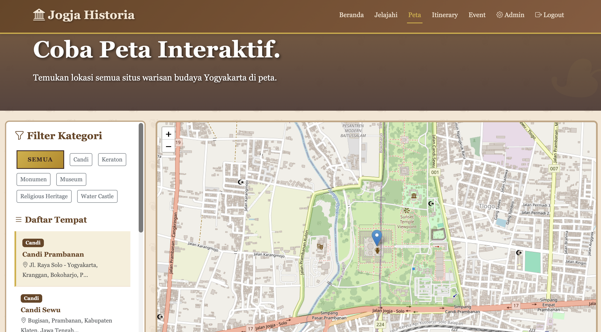

# Jogja Historia

A web-based heritage tourism platform for exploring historical and cultural sites in Yogyakarta. Built as a course project, Jogja Historia lets users discover museums, temples, royal palaces, fortresses, monuments, and other heritage locations across the city — complete with interactive maps, event listings, and a trip planner.

---

## Screenshots




## Features

### For Visitors

- **Browse Heritage Sites** — View all cultural and historical places categorized by type: Museum, Candi, Keraton, Benteng, Monumen, and Religious Heritage.
- **Search & Filter** — Full-text search across place names, descriptions, and addresses. Filter by category and sort by newest or alphabetical order.
- **Place Detail Page** — Each site has a dedicated page with a photo gallery, full historical description, opening hours, ticket pricing, contact info, website link, and upcoming events tied to that location.
- **Interactive Map** — All places plotted on an OpenStreetMap-powered Leaflet map with marker clustering, category filters, a sidebar place list, and one-click Google Maps directions.
- **Events & Calendar** — Upcoming events grouped by month, with date display, event description, location link, and optional ticket purchase link.
- **Trip Planner (Itinerary Builder)** — Drag-and-drop interface for building a personal visit itinerary. Filter and search places, arrange them by order, see estimated total duration, and save/share/print the result.

### For Admins

- **Admin Dashboard** — Overview statistics: total places, events, itineraries, and registered users. Shows recently added places and upcoming events at a glance.
- **Manage Places** — Add, edit, and delete heritage sites. Supports multiple image URLs (stored as JSON), geolocation coordinates, opening hours, ticket pricing, contact, and website.
- **Manage Events** — Create and manage events tied to specific locations, with date range and optional ticket link.
- **Session-Protected Routes** — Admin pages are protected by session middleware. Role-based access: `admin` and `user`.

---

## Tech Stack

| Layer | Technology |
|---|---|
| Backend | PHP 8.2 (native, no framework) |
| Database | MySQL / MariaDB 10.4 |
| Frontend | Bootstrap 5.3, Bootstrap Icons |
| Maps | Leaflet.js 1.9.4 + Leaflet.markercluster |
| Drag & Drop | jQuery UI 1.13.2 (Sortable) |
| Auth | PHP Sessions + `password_hash` / `password_verify` |

---

## Running Locally

### Prerequisites

- PHP 8.x
- MySQL or MariaDB
- A local server stack: [XAMPP](https://www.apachefriends.org/) or [Laragon](https://laragon.org/) (recommended)

### Steps

**1. Clone or copy the project**

```bash
git clone https://github.com/wildanrfq/jogja-historia.git
```

Or copy the `jogja-historia/` folder into your server's web root:
- XAMPP: `C:/xampp/htdocs/jogja-historia/`
- Laragon: `C:/laragon/www/jogja-historia/`

**2. Import the database**

Open phpMyAdmin at `http://localhost/phpmyadmin`, then:

1. Create a new database named `jogja_historia`
2. Select the database, go to the **Import** tab
3. Upload and import `jogja_historia.sql`

**3. Configure the database connection**

Open `config.php` and adjust if needed:

```php
$host_db = 'localhost';
$nama_db = 'jogja_historia';
$user_db = 'root';
$pass_db = '';
```

**4. Run the local server**

Start Apache and MySQL from your XAMPP/Laragon control panel, then open:

```
http://localhost/jogja-historia/
```

### Admin Access

The SQL dump includes a default admin account:

| Field | Value |
|---|---|
| Email | `admin@jogjahistoria.id` |
| Password | `admin123` |
